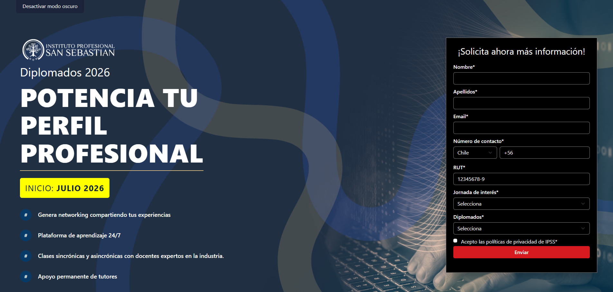
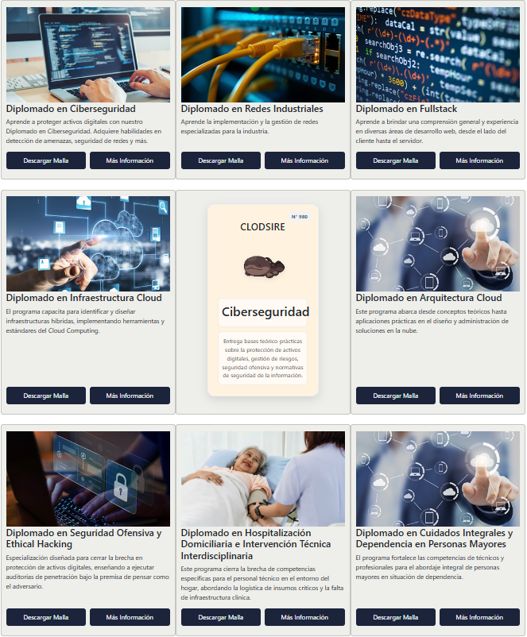
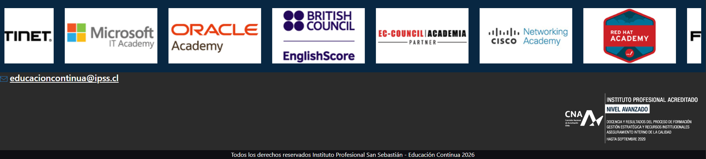

# IPSS-evaluacion-modulos-1-y-2

Clon académico de la landing page de diplomados IPSS 2026, desarrollado con HTML5, Bootstrap 5, CSS personalizado y JavaScript vanilla.

## Nombre del grupo

EVALUACION 1 DIPLOMADOS IPSS

## Integrantes

- Tomás Álvarez Chávez
- Sergio Casapia Churata

## Descripción

Sitio estático desarrollado como clon visual de la landing page de Educación Continua IPSS. El objetivo es replicar la estructura, disposición y estilo general de la página objetivo usando los conocimientos de las clases 1, 2 y el material complementario.

## Demo

Sitio desplegado: https://gakertz.github.io/IPSS-evaluacion-clases-1-y-2/

## Capturas del sitio

### Formulario de contacto




### Catálogo de diplomados




### Carrusel de certificaciones y footer



## Cómo correr localmente

```bash
git clone https://github.com/Gakertz/IPSS-evaluacion-clases-1-y-2
cd IPSS-evaluacion-clases-1-y-2
# Abrir index.html en el navegador
# O con un servidor:
python3 -m http.server 8000
```
## Evolutivos implementados

Desde el tag "v1.0" se incorporaron mejoras funcionales, visuales y de organización del proyecto, orientadas a cumplir los requerimientos de la segunda etapa de evaluación.

### Modularización del código JavaScript

Se reorganizó la lógica JavaScript en archivos separados según responsabilidad. El archivo "js/main.js" quedó como punto central de inicialización del sitio, importando las funcionalidades principales:

- Modo oscuro.
- Validación del formulario.
- Funcionalidades de botones del catálogo.
- "Envío" y descarga del formulario.

## Archivos incorporados:

- modo_oscuro.js
- validacion.js
- submit.js
- btnCatalogo.js
- api.js

## Decisiones técnicas
Para cumplir con los requisitos de la evaluación y mantener el proyecto simple, la página se desarrolló sin frameworks ni dependencias adicionales.
---
### Organización del código JavaScript
El código JavaScript se separó en módulos para mantener una estructura más ordenada.

- main.js          -> inicializa las funcionalidades
- modo_oscuro.js   -> controla el modo oscuro
- validacion.js    -> valida teléfono y RUT
- submit.js        -> descarga el formulario como JSON al enviarlo
- btnCatalogo.js   -> controla los botones del catálogo
- api.js           -> realiza las peticiones con fetch

Se utilizó PokeAPI como API pública porque no requiere autenticación, responde en formato JSON y permite probar fácilmente el consumo de datos externos con fetch.
Además, se complementó con el archivo local data/datos.json, donde se guarda la información propia de los diplomados.
